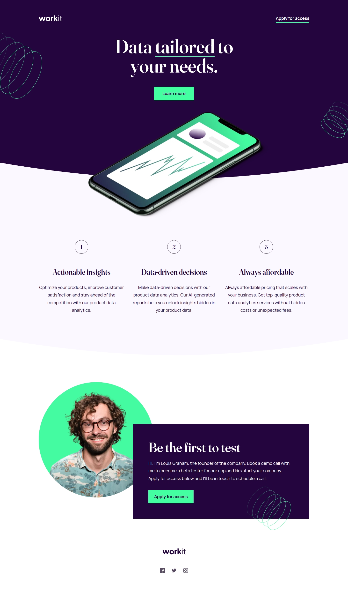

# Frontend Mentor - Workit landing page solution

This is a solution to the [Workit landing page challenge on Frontend Mentor](https://www.frontendmentor.io/challenges/workit-landing-page-2fYnyle5lu). Frontend Mentor challenges help you improve your coding skills by building realistic projects.

## Table of contents

- [Overview](#overview)
  - [The challenge](#the-challenge)
  - [Screenshot](#screenshot)
  - [Links](#links)
- [My process](#my-process)
  - [Built with](#built-with)
  - [What I learned](#what-i-learned)
  - [Continued development](#continued-development)
  - [Useful resources](#useful-resources)
- [Author](#author)

## Overview

### The challenge

Users should be able to:

- [x] View the optimal layout for the interface depending on their device's screen size
- [x] See hover and focus states for all interactive elements on the page

### Screenshot

### Links

- [Frontend Mentor solution page](https://www.frontendmentor.io/solutions/workit-responsive-landing-page-ft-11ty-cube-css-and-tailwind-fMCTOX1Ekt)
- [Live site](https://joshjavier.github.io/workit-landing-page/)

## My process

### Built with

- Semantic HTML5 markup
- CSS custom properties
- Flexbox
- Mobile-first workflow
- [Eleventy](https://www.11ty.dev/)
- [Tailwind](https://tailwindcss.com/)
- [CUBE CSS](https://cube.fyi/)

### What I learned

Tailwind! I used it quite conservatively in conjunction with CUBE CSS, which means I still wrote component-based classes instead of taking a utility-first approach. But I definitely see the benefit of using Tailwind, especially for rapid UI development during the early phases of a project. I especially like how it can process design tokens and convert them into CSS custom properties that I can use in my code.

The source code of [Build Excellent Websites](https://buildexcellentwebsit.es/) is my primary inspiration for this project. I tried my best to practice the principles in that site, which is why I only used 2 media queries for this solution (not counting the ones in resets and config files). The rest of the layout are handled by utility classes, such as the Switcher a.k.a. the [Flexbox Holy Albatross](https://heydonworks.com/article/the-flexbox-holy-albatross-reincarnated/) by Heydon Pickering.

I also gained more confidence working with SVG:

- For the logos, I used inline SVG in the header and footer instead of \ tags.
- I combined the social media icons into an icon sprite embedded in the page, which avoids extra HTTP requests.

### Continued development

- Be consistent on how to implement fluid sizing. In Tailwind config, I defined fluid sizes for text, but not spacing because they're more varied. Because of this, I often get lost trying to find the right CSS file where I set a value. Better if there's a single source of truth.

### Useful resources

- [The Flexbox Holy Albatross](https://heydonworks.com/article/the-flexbox-holy-albatross/) and [The Flexbox Holy Albatross Reincarnated](https://heydonworks.com/article/the-flexbox-holy-albatross/) by Heydon Pickering
- [Build Excellent Websites](https://buildexcellentwebsit.es/) by Andy Bell

## Author

- [Personal website](https://joshjavier.com/)
- [Frontend Mentor](https://www.frontendmentor.io/profile/joshjavier)
- [Twitter](https://twitter.com/joshjavierr)
- [LinkedIn](https://ph.linkedin.com/in/joshjavier)
